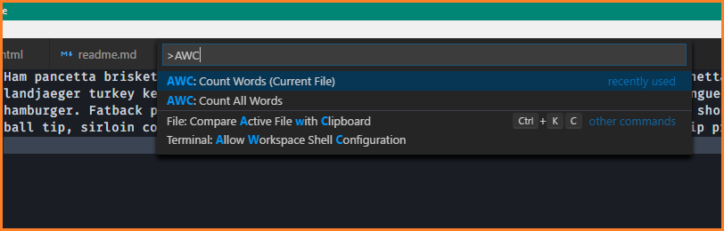
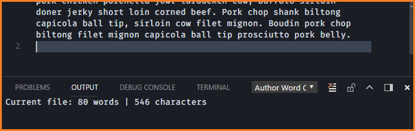
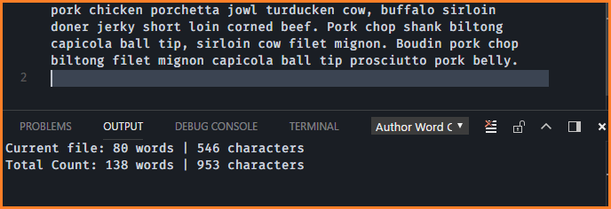

# author-wordcount

## Description

This **Visual Studio Code extension** allows tracking word count across multiple **markdown** files, a feature that will be beneficial to anyone used to writing with a program like Scrivener.

The target audience for this extension is indie authors who would like to gain the benefits of leveraging source control systems like Git and also, free software never hurts.

## Features

* Count words in the current file
* Count words across all markdown files in a specified folder
  * Including subfolders
* Count all words in project folder markdown files regardless of hierarchy

## Screenshots

### Count current file:

## Count files in folder

<!-- Tip: Many popular extensions utilize animations. This is an excellent way to show off your extension! We recommend short, focused animations that are easy to follow. -->

## Extension Settings

This extension contributes the following settings:

* `authorWordCount.mainFolder`: default folder for word counting
  * Expected values: `"folder name"` or `null`

## Known Issues, Upcoming Features

Defect (D) or upcoming Feature (F) - not necessarily planned in this order.

* F: Show word count on status bar (bottom of screen)
* F: Add hotkey or chord for counting words in current file
* F: Add hotkey or chord for counting words in folder from settings
* F: Ability to see word count for highlighted/selected words
* F: Attempt to show page count (how to estimate this?)
* F: Attempt to show daily word count (not sure if possible)

## Release Notes

### 1.0.0

Initial release of author-wordcount
* Enable VSC command for counting words in current file
* Enable VSC command for counting words in folder
